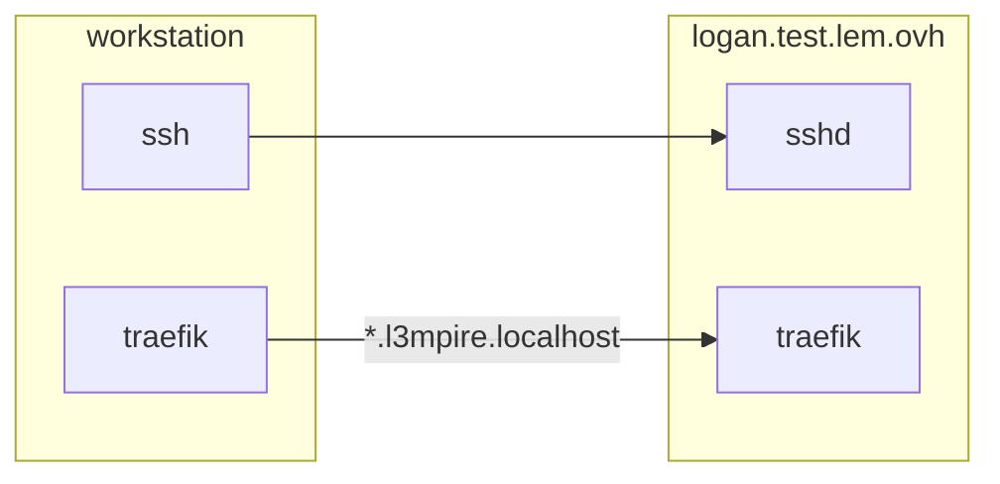

# docker-test

# Goal

abstract: Provide lempire DEVOPS exercices
intent:

- challenge deploy skills container/vms
- challenge CI/CD understanding
- challenge tools picking

We provide you a server with pre-installed docker. We'll provide you authentication by email.

For this test, we propose you to show your devops skills:

- Deploy jenkins or other CI/CD however you want on this server.

- Setup a CI workflow to automate:
  - a code nodejs linter for docker-test/node-app.
  - deploy suggested './nodejs-app' (or any nodejs app your choice) as a docker app. Create image, build image/ run image.

Important: We wish you expose the app to public internet, but do not expose the docker directly.

Provide your solution as a PR.

--
lempire devops team.

# Design

## Concepts

1. Architecture is based on a single VM hosting [Docker](https://www.docker.com/) containers.
1. Applications & Services are deployed as [Docker Compose](https://docs.docker.com/compose/) stacks.
1. An Ingress exposes HTTP services on-demand.
1. Support services (Ingress, CI/CD, etc.) are deployed with Ansible.

## Architecture



## Access path / Services

* Traefik
    * API/Dashboard:
      * URL: `http://traefik.l3mpire.localhost`
      * Credentials: `admin` / (provided password)

# Implementation

## Ansible

### Prerequisites

* Add public SSH key to `pikachu@logan.test.lem.ovh:.ssh/authorized_keys`
* Setup SSH configuration in `~/.ssh/config`:

```
Match host "logan.test.lem.ovh" user "pikachu"
	IdentityFile ~/.ssh/keys/pikachu__logan.test.lem.ovh
```

* Install Ansible dependencies:

```bash
ansible-galaxy role install -r requirements.yml &&
ansible-galaxy collection install -r requirements.yml
```
